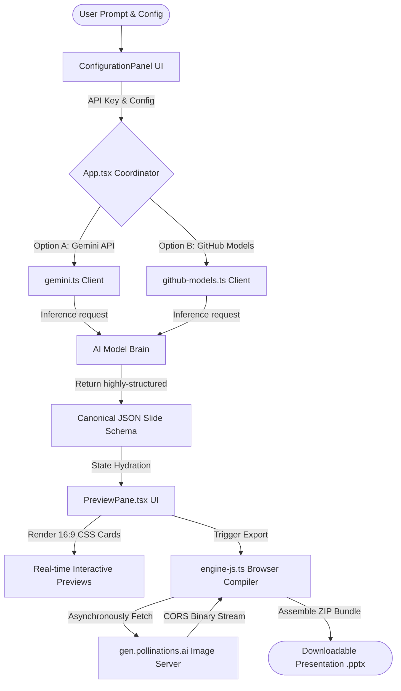

# 🎨 SlideCrafter AI — Premium Open-Source Presentation Engine

SlideCrafter AI is an agency-grade presentation engine designed to engineer high-converting "persuasion architectures" rather than boring corporate slides. Powered by a **dual-model AI brain** (Google Gemini & GitHub Models Copilot Inference) and a **browser-native PowerPoint compiler**, SlideCrafter AI generates fully-styled, design-rich, editable `.pptx` decks complete with contextual AI stock images in seconds.

---

## 🚀 Key Capabilities

*   **🧠 Dual-Model Inference Brain:** 
    *   **Google Gemini API:** Direct, lightning-fast structured JSON generation using Gemini 2.5 Flash.
    *   **GitHub Models Catalog:** Full support for enterprise and reasoning models including **OpenAI (GPT-4o, o3-mini, o4-mini)**, **Meta (Llama 4)**, **xAI (Grok 3)**, **DeepSeek (R1)**, and **Mistral**.
*   **💻 Browser-Native Slide Compilation:** Compiles decks client-side in the browser using `pptxgenjs`, eliminating backend lag and keeping private API keys and slide data fully secure on your machine.
*   **🖼️ Pollinations AI Image Engine (`gen.pollinations.ai`):** Automatically creates, fetches, and embeds high-fidelity professional stock photography matching each slide's specific content. It also features CORS-compliant direct-binary bundling to guarantee PowerPoint files never corrupt.
*   **📊 Dynamic Chart Visualizer:** Generates interactive CSS previews for data-rich slide types (such as Bar and Doughnut charts) which translate directly into native, fully-editable Microsoft PowerPoint chart components upon export.
*   **✨ Pro Max Glassmorphic UI:** A premium, modern web panel built on React + Vite + Tailwind CSS featuring fluid GSAP micro-animations, real-time 16:9 widescreen slide cards, and an elegant progressive transition loading overlay.

---

## 📁 Repository Architecture

The project is structured to keep the core React web app, design tokens, CLI tools, and agent instructions modular and highly organized:

```text
SlideCrafter-AI/
├── README.md                   ← You are here (Core repo roadmap)
├── .gitignore                  ← Root Git filter (safely ignores binaries, env, and node_modules)
├── .env.example                ← Template configuration for API credentials
├── package.json                ← Legacy/root CLI configurations
├── requirements.txt            ← CLI Python dependencies
├── AGENT.md                    ← Master directives for coding assistant pairing
├── elite_ppt_system_prompt.md  ← Gold-standard system prompt defining design layouts
├── content-agent.md            ← Context rules for the narrative content generator
├── slide-builder-agent.md      ← Context rules for the visual slide composer
├── slide-schema.json.md        ← Canonical JSON schema for structured model outputs
├── generate.js                 ← Node.js legacy CLI slide generation entry point
├── generate.py                 ← Python legacy CLI slide generation entry point
├── engine.js                   ← Node.js CLI pptxgenjs compiler
├── engine.py                   ← Python CLI python-pptx compiler
├── ppt_generator_loading.html  ← Legacy HTML dashboard layout
│
├── design-system/              ← Design tokens and CSS specifications
│   └── pptgen/
│       └── MASTER.md           ← Central design rules (color schemes, font pairings)
│
└── web/                        ← 💻 SlideCrafter AI React Frontend (Vite)
    ├── package.json            ← Web application dependencies (React, GSAP, pptxgenjs)
    ├── vite.config.ts          ← Vite compiler and dev server settings
    ├── tsconfig.json           ← TypeScript configurations
    ├── index.html              ← HTML container
    ├── public/
    │   └── favicon.svg         ← App brand icon
    └── src/
        ├── App.tsx             ← Main controller and interface coordinator
        ├── index.css           ← Global glassmorphic stylesheet and animation keyframes
        ├── main.tsx            ← React bootstrap entry point
        ├── assets/             ← Local brand assets
        ├── components/         ← Core modular UI widgets
        │   ├── ConfigurationPanel.tsx ← Theme, model selection, and prompt inputs
        │   ├── PreviewPane.tsx        ← 16:9 slide renderer and pptxgenjs compilation caller
        │   └── LoadingOverlay.tsx     ← CSS-animated generation progress state
        └── lib/                ← API connectors and compiling engines
            ├── gemini.ts              ← Google Gemini API client & system prompt definition
            ├── github-models.ts       ← GitHub Models Inference API client
            └── engine-js.ts           ← browser-native PPTX layout builder & image parser
```

---

## ⚙️ How It Works (System Pipeline)



1.  **Configure Theme & Engine:** The user describes their topic, sets slide length, selects a style preset (Modern Dark, Minimal Light, Neon Tech, warm Editorial, corporate Blue), and inputs their Gemini or GitHub token.
2.  **Generate Structured Narrative:** The app transmits the topic to the selected LLM with a detailed System Prompt that acts as a creative director. The model outputs a clean JSON object containing titles, bullet insights, KPIs, chart data, and image prompts matching the Slide Schema.
3.  **Real-Time Review:** The UI parses the JSON instantly and displays aspect-ratio-corrected previews. The user can preview layouts and view custom CSS charts.
4.  **Browser Compilation:** When clicking **Export**, `engine-js.ts` executes browser-native `pptxgenjs` commands, asynchronously downloads the CORS-compliant generated AI stock images directly, embeds the media into the slides, and packages the presentation into a perfect, fully-editable PowerPoint file!

---

## 🎨 Creative Theme Presets

SlideCrafter AI supports rich, harmonic design presets that map directly to system fonts and curated 60-30-10 color palettes:

| Style Preset | Primary BG | Secondary | Accent (CTA) | Typography Mood | Best For |
| :--- | :--- | :--- | :--- | :--- | :--- |
| **Deep Tech** | `#0A0E27` (Midnight) | `#1B2FFF` (Blue) | `#00F5C4` (Neon Teal) | Tech precision (Arial) | Software, AI, Crypto |
| **Luxury Finance** | `#1A0A00` (Dark Oak) | `#C9A84C` (Gold) | `#F5EDD6` (Champagne) | Executive gravitas (Georgia) | Premium real estate, Wealth |
| **Clean SaaS** | `#0A0F2C` (Navy) | `#3D5AF1` (Indigo) | `#00D4FF` (Sky Blue) | Tech precision (Calibri) | Modern apps, SaaS pitches |
| **Climate/ESG** | `#0B3D2E` (Forest) | `#3CB371` (Emerald) | `#E8F5E9` (Mint) | Academic authority (Garamond)| Green tech, Non-profits |
| **Creative Agency**| `#FF6B6B` (Coral) | `#4ECDC4` (Turquoise) | `#F7FFF7` (Off-white) | Modernity (Trebuchet MS) | Marketing, Portfolios |

---

## 📝 Canonical Slide Schema

Every generated presentation complies strictly with the following structured JSON output:

```json
{
  "title": "A $340B Market With No Clear Winner — Yet",
  "theme": {
    "primaryColor": "#0A0F2C",
    "secondaryColor": "#3D5AF1",
    "accentColor": "#00D4FF",
    "fontTitle": "Arial",
    "fontBody": "Calibri",
    "darkBackground": true
  },
  "slides": [
    {
      "index": 1,
      "type": "title",
      "title": "Scaling Intelligence: The Next Frontier of Compute",
      "subtitle": "How decentralized hardware clusters are redefining training costs.",
      "eyebrow": "CONFIDENTIAL // SCALER TECH",
      "imageKeywords": "supercomputer, AI training server room, neon cables",
      "notes": "Good morning. Today we are discussing cost curves in decentralized training..."
    }
  ]
}
```

*Supported slide types include:* `"title"`, `"content"`, `"stats"`, `"chart"`, `"quote"`, `"image-text"`, `"two-column"`, and `"closing"`.

---

## 🛠️ Quick Start (Local Setup)

To launch the premium React Web frontend application locally:

### 1. Initialize and Setup dependencies
Navigate to the `web/` directory and install the necessary package dependencies:
```bash
cd web
npm install
```

### 2. Launch the Local Dev Server
Run the development environment locally:
```bash
npm run dev
```
Vite will start the server, typically serving the application at **`http://localhost:5176/`** or **`http://localhost:5175/`**. Open the address in your browser to start generating stunning slide decks!

### 3. Open-Source Attribution
SlideCrafter AI is fully open-sourced under your GitHub repository. Feel free to contribute, add new slide themes, or expand the layout builders inside `engine-js.ts`!

---

## 📝 License

This project is open-sourced under the **MIT License**. See the [LICENSE](file:///d:/PPtGen/LICENSE) file for the full copyright and permission terms.

Copyright (c) 2026 Syed Mahi. All rights reserved.
